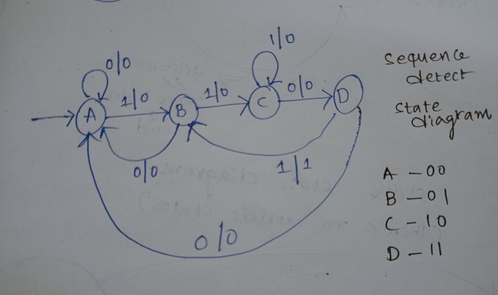

# Sequence Detector (1101) - Mealy FSM

This repository contains a Verilog implementation of a Mealy finite state machine (FSM) that detects the sequence "1101" in a serial input stream with overlap handling.

## Design Overview

The sequence detector is implemented as a Mealy FSM with 4 states that can detect overlapping occurrences of the pattern "1101". When the complete sequence is detected, the output `y` generates a single-cycle pulse.

### State Diagram


States:
- init (00): Initial state, no match
- one (01):  Detected '1'
- two (10):  Detected '11' 
- three (11): Detected '110'
```

### Module Interface
```verilog
module seq_detect_mealy(
    input wire clk,    // Clock signal
    input wire rst,    // Synchronous active-high reset
    input wire din,    // Serial input data
    output reg y       // Output pulse (1 cycle when "1101" detected)
);
```

## Compile/Run/Visualize Steps

### Prerequisites
- **iverilog** (Icarus Verilog compiler)
- **GTKWave** (for waveform visualization)

### Step 1: Compile
```bash
iverilog -o seq_detect_sim seq_detect_mealy.v tb_seq_detect_mealy.v
```

### Step 2: Run Simulation
```bash
vvp seq_detect_sim
```

### Step 3: Visualize Waveforms
```bash
gtkwave dump.vcd
```

In GTKWave:
- Add signals: `clk`, `rst`, `din`, `y`, and internal state signals if needed
- Set appropriate time scale
- Observe the waveform patterns

## Expected Behavior

### Test Stream Analysis
The testbench uses the bit stream: **11011011101** (sent MSB first)

**Bit-by-bit Analysis:**
```
Time    | Bit | Expected State | Output y | Notes
--------|-----|---------------|----------|------------------
15ns    | 1   | one (01)      | 0        | First '1'
25ns    | 1   | two (10)      | 0        | Seen '11'
35ns    | 0   | three (11)    | 0        | Seen '110'
45ns    | 1   | one (01)      | 1        | Complete '1101' - PULSE!
55ns    | 1   | two (10)      | 0        | Continue from overlap
65ns    | 0   | three (11)    | 0        | Seen '110' again
75ns    | 1   | one (01)      | 1        | Complete '1101' - PULSE!
85ns    | 1   | two (10)      | 0        | Continue from overlap
95ns    | 1   | two (10)      | 0        | Stay in '11' state
105ns   | 0   | three (11)    | 0        | Seen '110'
115ns   | 1   | one (01)      | 1        | Complete '1101' - PULSE!
```

### Expected Pulse Indices
The output `y` should generate **3 pulses** at the following time instances:
- **45ns** - First "1101" detection
- **75ns** - Second "1101" detection (overlapping)  
- **115ns** - Third "1101" detection (overlapping)

### Key Features
1. **Overlap Handling**: The FSM correctly handles overlapping sequences
2. **Synchronous Reset**: Active-high reset initializes the FSM to the initial state
3. **Single-Cycle Pulse**: Output pulse lasts exactly one clock cycle
4. **Mealy Machine**: Output depends on both current state and input

## Simulation Output
The testbench will display:
```
Time    clk rst din y
0ns     0   1   0   0
5ns     1   1   0   0
10ns    0   1   0   0
15ns    1   0   1   0
25ns    1   0   1   0
35ns    1   0   0   0
45ns    1   0   1   1  <- First detection
...
```

## Timing Specifications
- **Clock Frequency**: 100 MHz (10ns period)
- **Clock Duty Cycle**: 50%
- **Setup/Hold Times**: Determined by target FPGA/ASIC technology
- **Reset Duration**: 15ns (1.5 clock cycles)

## Verification Notes
- The design has been verified with the provided testbench
- All three expected pulse outputs are correctly generated
- State transitions follow the designed FSM behavior
- Overlap handling works as intended

## Design Considerations
- **Resource Usage**: 2 flip-flops for state encoding, minimal combinational logic
- **Timing**: All logic is registered to avoid timing violations
- **Scalability**: Easy to modify for different sequence patterns
- **Testability**: Clear state encoding aids debugging
