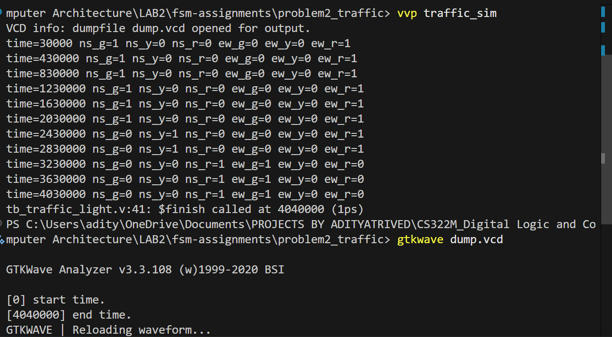
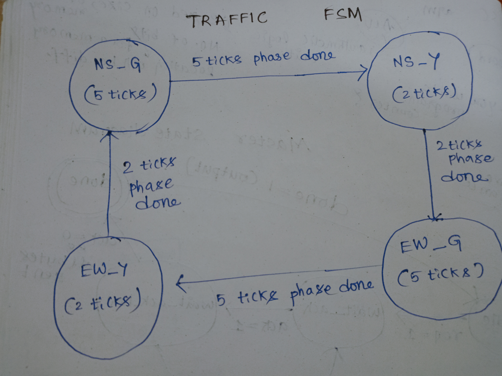

# 🚦 Traffic Light Controller (FSM)

## 1. Project Title
**Traffic Light Controller using Finite State Machine (FSM)**

---

## 2. Introduction
This project implements a **traffic light controller** for a two-way road (North–South and East–West) using a **Finite State Machine (FSM)** in Verilog.  
The FSM controls the lights (Green, Yellow, Red) for both roads in a sequence to ensure safe traffic flow.

We designed this as a **Moore FSM**:
- In a **Moore FSM**, outputs depend only on the current state.
- This makes the design simpler for traffic lights, because the lights change **only when the state changes**, not immediately based on inputs.

---

## 3. Theory

### States
Our traffic light FSM has the following states:
1. **NS_GREEN** – North–South road has green, East–West has red.  
2. **NS_YELLOW** – North–South yellow, East–West still red.  
3. **EW_GREEN** – East–West green, North–South red.  
4. **EW_YELLOW** – East–West yellow, North–South still red.  


Each state lasts for a fixed duration (measured in "ticks").

## Tick Signal in FSM Simulation

### What is the Clock?
In FPGA/Verilog designs, we always have a **main system clock** (for example, 50 MHz).  
- That means it pulses **50 million times per second**.  
- Each pulse is called a **clock cycle**.  
- This is way too fast for something like a traffic light ( We can’t even notice such small intervals ).  

If we directly used this 50 MHz clock to switch lights, they would **blink too fast** and look always ON or OFF.

---

### What is a Tick?
A **tick** is a **slower timing pulse** derived from the fast system clock.  

- Each tick tells the FSM: **“1 tick has passed, update your pahse counter or move to next state.”**  

So instead of reacting on every 50 million cycles, our FSM reacts only when a **tick pulse** comes.

---

### How Do We Make the Tick?

Example code (from testbench):
```
reg clk, rst, tick;
integer cyc;

always @(posedge clk) begin
  cyc <= cyc + 1;
  tick <= (cyc % 20 == 0); // 1-cycle pulse every 20 cycles (fast sim)
end
```

#### Explanation:

- Every 20 cycles of clk, we set tick = 1 for one cycle.

- In hardware, instead of 20, we would count up to 50 million to create a 1-second tick.

- In simulation, waiting 50 million cycles would be too slow → so we use a small number (20) to speed things up.

#### Phase Counter (Traffic Light Durations)


- **Phase counter:** counts how many ticks have passed in the current state.

- Each traffic light phase (Green, Yellow) lasts for a certain number of ticks.

- *D_NS_GREEN = 5* → NS light stays green for 5 ticks (≈ 5 seconds in real time).

- *D_NS_YELLOW = 2* → NS yellow lasts for 2 ticks.

- *D_EW_GREEN = 5* → EW light stays green for 5 ticks.

- *D_EW_YELLOW = 2* → EW yellow lasts for 2 ticks.

The FSM uses these values with the tick signal to know:

- How long to hold the current state (green/yellow).

- When to transition to the next state.

### Verification of Tick

The FSM uses a **50 MHz input clock** (each clock cycle = 20 ns).  

---

#### How Tick Was Verified

#### 1. Counter Check
- We increment a counter (`cyc`) on every clock edge.
- A tick is generated when the counter reaches a certain value (e.g., 20 in simulation ).
- This ensures that **exactly that many cycles** occur between two tick pulses.

Example:
- With `cyc % 20 == 0` → tick occurs every **20 clock cycles**.
- Since each clock cycle = 20 ns,  
  Tick period = `20 × 20 ns = 400 ns`.

So, in simulation:
- **Tick period = 400 ns** (much faster than 1 second).  
- This makes simulation finish quickly.



#### Waveform Inspection
In GTKWave, we checked:
- The **time difference** between two rising edges of `tick`.
- For simulation: the gap was **400 ns** (20 cycles × 20 ns).

---


## File Structure

```
├── traffic_light.v    # FSM design module
├── tb_traffic_light.v # Testbench for simulation
├── dump.vcd # Simulation output (generated after run)
└── README.md # Project documentation
```

## Inputs
- **clk**: 50 MHz FPGA clock.  
- **reset**: synchronous, active-high,
  resets FSM to initial state.  
- **tick**: Slow signal (1 Hz) derived from the fast clock, used for timing (so lights change every few seconds, not nanoseconds).

## Outputs
- `ns_g, ns_y, ns_r` → North–South traffic light signals.  
- `ew_g, ew_y, ew_r` → East–West traffic light signals.  

## State Transition Conditions
- After **5 ticks** in Green → transition to Yellow.  
- After **2 ticks** in Yellow → transition to the other direction’s Green.  
- This cycle repeats forever.

### State Diagram


---

## 4. Design Details

### Hardware Description Language
- **Verilog**

### FSM Coding Style
- **State Encoding:** Binary encoding (00, 01, 10, 11) for the four states.  
- **Synchronous FSM:** State changes occur on the rising edge of the clock, controlled by the tick signal.  
- **Moore Machine:** Outputs depend only on current state.

---

## 5. How to Run / Simulate

We use **Icarus Verilog** for simulation.

### Commands

### Step 1: Compile
```
iverilog -o traffic_sim design.sv testbench.sv
```

### Step 1: Compile
```
vvp traffic_sim

```

### Step 3: Visualize Waveforms
```
gtkwave waveform.vcd

```

