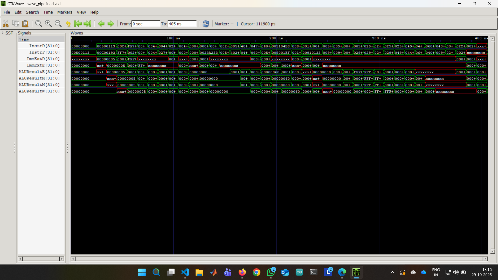

# RISCV_PIPELINE - RVX10-P: 5-Stage Pipelined RISC-V Processor 

## 🎯 What is RVX10-P?

**RVX10-P** is a **5-stage pipelined processor** that implements:
- The **RV32I** instruction set (base RISC-V 32-bit integer instructions)
- **10 custom ALU instructions** (the RVX10 extension)

Developed as part of the course Digital Logic and Computer Architecture taught by Dr. Satyajit Das, IIT Guwahati.

### Key Features:
- **5-Stage Pipeline**: IF → ID → EX → MEM → WB  
- **Hazard Detection**: Automatically handles data and control hazards  
- **Data Forwarding**: Speeds up execution by bypassing stalls when possible  
- **Performance Counters**: Tracks cycles and instructions executed  
- **SystemVerilog Implementation**: Written in modern hardware description language

---

## 🏗️ Architecture Overview

### The Five Pipeline Stages

```
┌─────────┐    ┌─────────┐    ┌─────────┐    ┌─────────┐    ┌─────────┐
│   IF    │ -> │   ID    │ -> │   EX    │ -> │   MEM   │ -> │   WB    │
│ (Fetch) │    │ (Decode)│    │(Execute)│    │(Memory) │    │ (Write) │
└─────────┘    └─────────┘    └─────────┘    └─────────┘    └─────────┘
     ↓              ↓              ↓              ↓              ↓
  Get Next    Read Regs      Do Math       Access         Write
Instruction   & Decode       in ALU         RAM           Result
```

### Module Hierarchy

```
riscvpipeline (Top Module)
│
├── riscv (Processor Core)
│   ├── controller (Control Unit)
│   │   ├── maindec (Main Decoder)
│   │   ├── aludec (ALU Decoder)
│   │   └── Control Pipeline Registers (c_ID_IEx, c_IEx_IM, c_IM_IW)
│   │
│   ├── datapath (Data Processing Path)
│   │   ├── PC Register (Program Counter)
│   │   ├── regfile (32 General Purpose Registers)
│   │   ├── alu (Arithmetic Logic Unit)
│   │   ├── extend (Immediate Extension)
│   │   └── Pipeline Registers (IF_ID, ID_IEx, IEx_IMem, IMem_IW)
│   │
│   ├── forwarding_unit (Data Hazard Handler)
│   └── hazard_unit (Stall & Flush Controller)
│
├── imem (Instruction Memory - ROM)
└── dmem (Data Memory - RAM)
```
```
📁 Project Structure
RVX10-P/
│
├── src/                              # Source code directory
│   ├── riscvpipeline.sv             # Top-level module (instantiates processor + memories)
│   ├── controller.sv                # Control unit (maindec, aludec, control pipeline regs)
│   ├── datapath.sv                  # Datapath (ALU, regfile, pipeline registers, muxes)
│   ├── hazard_unit.sv               # Hazard detection (load-use stalls, branch flushes)
│   └── forwarding_unit.sv           # Data forwarding logic (EX/MEM, MEM/WB hazards)
│
├── tb/                              # Testbench directory
│   └── tb_pipeline.sv               # Self-checking testbench (monitors MEM stage)
│
├── tests/                           # Test programs directory
│   └── rvx10_pipeline.hex           # Test program in hexadecimal machine code
│
├── docs/                            # Documentation directory
│   ├── REPORT.md                    # Detailed design report
│   ├── pipeline_overview.png       # Waveform: Multiple instructions in pipeline
│   ├── Forwarding_Hazard.png       # Waveform: Data forwarding example
│   ├── Load_Hazard.png             # Waveform: Load-use stall example
│   └── Control_Hazard.png          # Waveform: Branch flush example
│
├── README.md                        
└── wave_pipelined.vcd              # Generated waveform file (after simulation)

```
---

## Understanding Each Pipeline Stage

### 1️⃣ IF - Instruction Fetch Stage

**What happens here?**
- Reads the next instruction from memory
- Updates the Program Counter (PC)
- Calculates PC+4 for the next instruction

**Key Components:**
- `PCF`: Current program counter
- `InstrF`: Instruction fetched from memory
- `pcmux`: Chooses between PC+4 (sequential) or branch target

---

### 2️⃣ ID - Instruction Decode Stage

**What happens here?**
- Decodes the instruction to understand what operation to perform
- Reads data from registers
- Extends immediate values (sign extension)
- Generates control signals

**Key Components:**
- `maindec`: Decodes opcode → generates control signals
- `aludec`: Determines ALU operation
- `regfile`: 32 registers (x0-x31)
- `extend`: Sign-extends immediate values

---

### 3️⃣ EX - Execute Stage

**What happens here?**
- Performs arithmetic/logic operations in the ALU
- Calculates branch targets
- Determines if branches are taken
- **Data forwarding happens here!**

**Key Components:**
- `alu`: Performs operations (add, sub, and, or, RVX10 ops)
- `forwardMuxA` & `forwardMuxB`: Select correct operands (handle hazards)
- Branch logic: `PCSrcE = (BranchE & ZeroE) | JumpE`

**ALU Operations (from `alu` module):**
```
0000: ADD    0110: ANDN   1001: MIN    1101: ROL
0001: SUB    0111: ORN    1010: MAX    1110: ROR
0010: AND    1000: XNOR   1011: MINU   1111: ABS
0011: OR     ----         1100: MAXU
0101: SLT
```

---

### 4️⃣ MEM - Memory Access Stage

**What happens here?**
- Reads from or writes to data memory
- Only `lw` (load) and `sw` (store) instructions use this stage
- Other instructions just pass through

**Key Signals:**
- `ALUResultM`: Memory address to access
- `WriteDataM`: Data to write (for `sw`)
- `ReadDataM`: Data read from memory (for `lw`)
- `MemWriteM`: Enable signal for writing

---

### 5️⃣ WB - Write Back Stage

**What happens here?**
- Writes the final result back to the register file
- Chooses between ALU result, memory data, or PC+4

**Result Selection (resultmux):**
```
ResultSrcW = 00 → ALU Result    (add, sub, custom ops)
ResultSrcW = 01 → Memory Data   (lw)
ResultSrcW = 10 → PC+4          (jal - for return address)
```
---

## 🎨 Custom RVX10 Instructions

The processor supports 10 **custom ALU operations** in addition to standard RISC-V instructions.

### The 10 Custom Instructions

| Instruction | Operation | Description | Example |
|-------------|-----------|-------------|---------|
| `ANDN` | `a & ~b` | AND with inverted b | Bit masking |
| `ORN` | `a \| ~b` | OR with inverted b | Set bits except b |
| `XNOR` | `~(a ^ b)` | Bitwise equivalence | Check equality |
| `MIN` | Signed min(a,b) | Minimum (signed) | Get smaller value |
| `MAX` | Signed max(a,b) | Maximum (signed) | Get larger value |
| `MINU` | Unsigned min(a,b) | Minimum (unsigned) | Get smaller value |
| `MAXU` | Unsigned max(a,b) | Maximum (unsigned) | Get larger value |
| `ROL` | Rotate left | Circular left shift | Cryptography |
| `ROR` | Rotate right | Circular right shift | Cryptography |
| `ABS` | Absolute value | Remove sign | Distance calculations |

## 🚀 How to Run This Project

### Prerequisites

You'll need:
-  **Icarus Verilog** (simulator) - [Download](http://iverilog.icarus.com/)
-  **GTKWave** (waveform viewer) - [Download](http://gtkwave.sourceforge.net/)
- A text editor (VS Code, Notepad++, etc.)

### Step-by-Step Instructions

#### 🪟 On Windows

**Step 1: Install Tools**
```cmd
:: Download and install Icarus Verilog (includes GTKWave)
:: From: http://bleyer.org/icarus/
```

**Step 2: Open Command Prompt**
```cmd
cd path\to\RVX10-P
```

**Step 3: Compile the Design**
```cmd
iverilog -g2012 -o pipelined_cpu riscvpipeline.sv
```
- `-g2012` enables SystemVerilog features
- `-o pipelined_cpu` names the output executable

**Step 4: Run Simulation**
```cmd
vvp pipelined_cpu
```

**Expected Output:**
```
Cycle=0 | MEM Stage: MemWriteM=x DataAdrM=0x0 WriteDataM=0x0
Cycle=1 | MEM Stage: MemWriteM=0 DataAdrM=0x0 WriteDataM=0x0
...
----------------------------------------
Simulation succeeded: Data written to memory.
WriteDataM=25 at DataAdrM=100 (Expected: 25 at 100)
--- PERFORMANCE: Cycles=42 | Retired Instructions=16 ---
VERIFICATION: Stored value in dmem[100] is 25 (0x19)
----------------------------------------
```

**Step 5: View Waveforms**
```cmd
gtkwave wave_pipelined.vcd
```

#### 🐧 On Linux/macOS

**Step 1: Install Tools**
```bash
# Ubuntu/Debian
sudo apt-get update
sudo apt-get install iverilog gtkwave

# macOS (with Homebrew)
brew install icarus-verilog gtkwave
```

**Step 2: Navigate to Project**
```bash
cd ~/path/to/RVX10-P
```

**Step 3: Compile**
```bash
iverilog -g2012 -o pipelined_cpu riscvpipeline.sv
```

**Step 4: Run**
```bash
vvp pipelined_cpu
```

**Step 5: View Waveforms**
```bash
gtkwave wave_pipelined.vcd &
```

---

### 🔧 Customizing the Test Program

The processor executes instructions from `test.txt`. This file contains **hexadecimal machine code**.

**To create your own test program:**

- Write RISC-V assembly code
- Assemble it to machine code (use RARS or similar)
- Convert to hex format
- Place each instruction on a new line in `test.txt`


## 📊 Understanding the Waveforms

### Opening Waveforms in GTKWave

- Run simulation (generates `wave_pipelined.vcd`)
-  Open GTKWave: `gtkwave wave_pipelined.vcd`
- In the left panel (SST), navigate the module hierarchy
- Select signals and click "Append" to view them


### 📈 Waveform 1: Overall Pipeline Execution

**File:** `pipeline_overview.png`



**What to look for:**
- Multiple instructions active in different stages simultaneously
- Pipeline registers (InstrD, InstrE, etc.) showing different instructions

---

### 🔄 Waveform 2: Data Forwarding

**File:** `Forwarding_Hazard.png`


**What to look for:**
- `ForwardAE` or `ForwardBE` signals changing to `10` or `01`
- `Rs1E` matching `RdM` or `RdW` (register match)
- `SrcAE` receiving forwarded data instead of stale register value

---

### ⏸️ Waveform 3: Load-Use Stall

**File:** `Load_Hazard.png`


**What to look for:**
- `ResultSrcE0 = 1` (load instruction in EX)
- `Rs1D` or `Rs2D` matches `RdE` (dependency detected)
- `StallF`, `StallD` = 1 (pipeline frozen)
- `FlushE` = 1 (bubble inserted)
- `PCF` and `InstrD` remain unchanged for one cycle

---

### 🔀 Waveform 4: Control Hazard (Branch Flush)

**File:** `Control_Hazard.png`


**What to look for:**
- `PCSrcE = 1` (branch taken)
- `FlushD` and `FlushE` pulse high
- Incorrect instructions in InstrD replaced with NOP (`00000033`)

---

### 📋 GTKWave Tips

**Useful Signal Groups to View:**

1. **Pipeline Overview:**
   - `clk`, `reset`
   - `InstrF`, `InstrD`, `PCF`
   - All pipeline register outputs

2. **Hazard Detection:**
   - `Rs1E`, `Rs2E`, `RdM`, `RdW`
   - `ForwardAE`, `ForwardBE`
   - `StallF`, `StallD`, `FlushE`, `FlushD`

3. **Control Signals:**
   - `RegWriteW`, `MemWriteM`
   - `ALUControlE`
   - `PCSrcE`

4. **Data Flow:**
   - `SrcAE`, `SrcBE`, `ALUResultE`
   - `WriteDataM`, `ReadDataM`
   - `ResultW`

**GTKWave Keyboard Shortcuts:**
- `Ctrl + +` / `Ctrl + -` : Zoom in/out
- `Ctrl + Alt + F` : Zoom to fit
- `Ctrl + G` : Go to time
- `Alt + →` / `Alt + ←` : Next/previous transition

---

## 📈 Performance Analysis

### Performance Counters

The processor tracks two key metrics:

**1. Cycle Count**
- Total number of clock cycles elapsed
- Increments every clock edge

**2. Instructions Retired**
- Number of instructions successfully completed
- Increments when an instruction:
  - Writes to a register (`RegWriteW`)
  - Writes to memory (`MemWriteM`)
  - Is a taken branch/jump (`PCSrcE`)

```systemverilog
always_ff @(posedge clk, posedge reset) begin
    if (reset) begin
        cycle_count   <= '0;
        instr_retired <= '0;
    end
    else begin
        cycle_count <= cycle_count + 1;
        if (RegWriteW | MemWriteM | PCSrcE) begin
            instr_retired <= instr_retired + 1;
        end
    end
end
```

---

### Calculating CPI (Cycles Per Instruction)

**CPI = Total Cycles / Instructions Retired**

**Example from simulation:**
```
Cycles: 42
Retired Instructions: 16
CPI = 42 / 16 = 2.625
```

**What does this mean?**
- Ideal pipelined processor: CPI = 1 (one instruction finishes per cycle)
- Our processor: CPI = 2.625 due to hazards (stalls, flushes)

**Hazard Impact:**
- **No hazards:** CPI ≈ 1
- **With forwarding:** CPI ≈ 1.2-1.5
- **With stalls/flushes:** CPI ≈ 2-3

---

### Improving Performance

**Ways to reduce CPI:**

1. **Better Branch Prediction**
   - Currently, we always assume branches NOT taken
   - Add a branch predictor to reduce control hazards

2. **Out-of-Order Execution**
   - Execute independent instructions while stalled
   - Requires complex scheduling logic

3. **Better Compiler**
   - Reorder instructions to minimize hazards
   - Insert useful work during stalls

4. **Deeper Pipeline**
   - Break stages into more sub-stages (e.g., 10-stage)
   - Trade-off: More hazard complexity

---

## ❓ Troubleshooting

### Problem: Compilation Errors

**Error:** `syntax error near 'logic'`
```
Solution: Add -g2012 flag for SystemVerilog support
iverilog -g2012 -o pipelined_cpu riscvpipeline.sv
```

**Error:** `test.txt: No such file or directory`
```
Solution: Create test.txt in the same directory
Make sure it contains valid hex instructions
```

---

### Problem: Simulation Doesn't Complete

**Symptom:** Simulation runs forever without "succeeded" message

**Possible Causes:**
1. **Test program doesn't write to address 100**
   - Check `test.txt` has a `sw` instruction to address 100
   - Expected: `sw x?, 100(x0)`

2. **Wrong data written to address 100**
   - Success criteria: Write value `25` to address `100`
   - Modify test program or testbench as needed

3. **Instruction memory not initialized**
   - Verify `test.txt` is in correct directory
   - Check `$readmemh("test.txt", RAM)` path

---

### Problem: No Waveform Output

**Symptom:** `wave_pipelined.vcd` not generated

**Solution:**
```systemverilog
// Check testbench has these lines:
initial begin
    $dumpfile("wave_pipelined.vcd");
    $dumpvars(0, testbench_pipelined);
end
```

---

### Problem: GTKWave Shows No Signals

**Solution:**
- In GTKWave, go to "SST" panel (left side)
- Expand `testbench_pipelined` → `dut` → `rv`
- Select signals (Ctrl+click for multiple)
- Click "Append" or press `Insert` key

---

### Problem: Wrong Results

**Debugging Steps:**

1. **Check PC progression:**
   - Watch `PCF` in waveform
   - Should increment by 4 each cycle (unless branch/stall)

2. **Check instruction decode:**
   - Watch `InstrD`, `ALUControlE`
   - Verify correct control signals generated

3. **Check register file:**
   - Add `dut.rv.dp.rf.rf` to waveform
   - Verify register writes happening correctly

4. **Check hazard detection:**
   - Watch `ForwardAE`, `ForwardBE`, `StallF`, `FlushE`
   - Verify forwarding/stalling at correct times

---

## 📚 Additional Resources

### Understanding RISC-V
- [RISC-V Specification](https://riscv.org/technical/specifications/)

- [RARS Simulator](https://github.com/TheThirdOne/rars) -

## 🏫 Acknowledgment
Developed under the guidance of<br>
Dr. Satyajit Das<br>
Assistant Professor<br>
Department of Computer Science and Engineering<br>
Indian Institute of Technology, Guwahati
